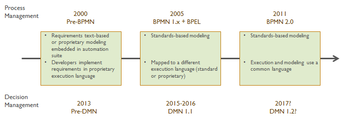
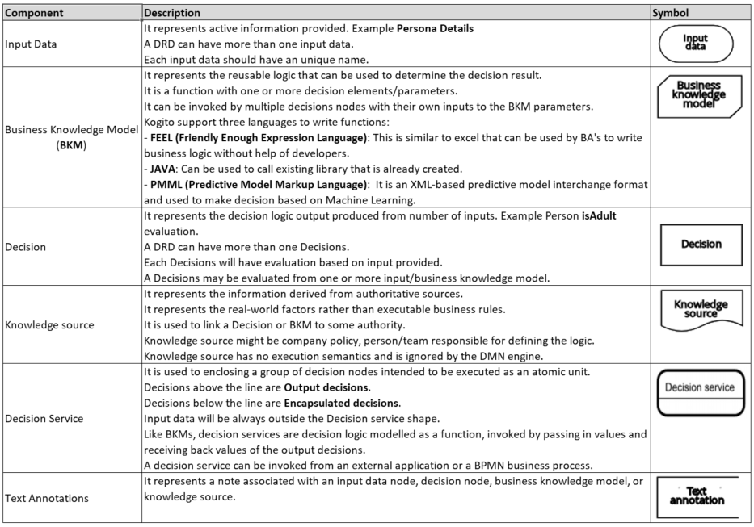
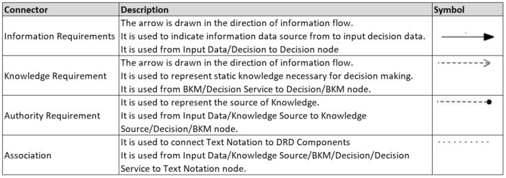
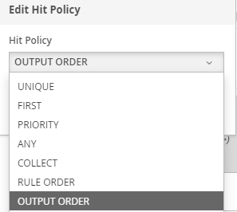
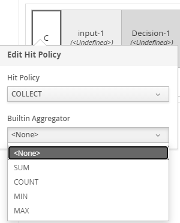

# Decision Model and Notation - DMN

## History
- Around 2000, process automation was based on proprietary software and this lead to no standardization.
- Business requirements were created in a combination of **text documents** and **proprietary modeling tools** included in the runtime.
- Five years later we had **BPMN 1.x**, a process modeling notation standard widely adopted by business users.
  - BPMN 1.x was not executable.
  - It had to be translated into some other language by programmers for execution.
  - BPM vendors used execution language called **BPEL** and convince customers that BPMN was the “Business face of SOA.”
  - This did not work out as translate models into some other language for implementation was the basic problem.
- Few years later we had **BPMN 2.0** released.
  - This ensured the modeling language and the execution language to be one and the same.
- Before DMN, decision requirements were documented using unstructured text (excel, word documents) or captured into proprietary modeling tools (BRE Rule Language).
- DMN vs Rule Engines
  - DRDs (Decision Requirements Diagram) are standard representation unlike proprietary Rule Family in The Decision Model.
  - DRD extends beyond a single decision service.
  - It can represent an extended business decision executed in multiple steps separated in time.
  - It may even include human decisions and external decisions 
- DMN is trying to unify standards-based modeling and execution in one step. DMN has five key elements:
  - DRD
  - Decision tables
  - FEEL, a new expression language
  - Boxed expressions, a visual representation of complex decision logic
  - Metamodel and XML Schema

## Basics
- Decision Model and Notation (DMN) is used to model decision service graphically.
- It is a standard established by the **Object Management Group (OMG)** for describing and modeling operational decisions.
- Kogito provides design and runtime support for **DMN 1.2** models at **conformance level 3**.
- It provides runtime-only support for DMN 1.1 and 1.3 models at conformance level 3. 
- DMN 1.1 and 1.3 models are currently not supported in the Kogito DMN modeler.
- DMN decision model are determined by below:
  
  - **DRD:** 
    - A decision requirements diagrams trace business decisions from start to finish.
    - It provides a business-friendly picture of the dependencies of a high-level business decision on supporting information.
    - Each decision node use logic defined in DMN boxed expressions such as decision tables.
    - A DRD can represent part or all of the DMN model.
    - DRD components and requirement connectors details are available [here](https://docs.jboss.org/kogito/release/latest/html_single/#_using_dmn_models_in_kogito_services). A brief overview given below.
    
    
  - **DRG:**
    - A Decision Requirements Graph models a domain of decision-making, showing the most important elements involved in it and the dependencies between them.
    - The elements modeled are **decisions**, **input data**, and **knowledge sources**. 
    - The visual representation of a DRG is called DRD.
- Decision login inside Decision Box is represented using below. These can be selected in Decision Box as given [here]()
  - **Decision Table:**
    - It is a tabular representation of input/output entries.
    - It is used to indicate which output entry applies to a specific set of inputs.
    - **Hit Policies** determine how to reach an outcome when multiple rules in a decision table match the provided input values.
    
    - **Single-hit policies:**
      - **Unique (U):**
        - Permits only one rule to match. 
        - Any overlap raises an error.
      - **Any (A):**
        - Permits multiple rules to match.
        - All matching rules must have the same output.
        - If multiple matching rules do not have the same output, an error is raised.
      - **First (F):**
        - Permits multiple rules to match, with different outputs.
        - Uses the first match in rule order.
      - **Priority (P):**
        - Permits multiple rules to match, with different outputs.
        - Result is the output value with the highest output priority.
        - The first value has the highest priority.
    - **Multiple-hit policies:**
      - **Rule Order (R):**
        - Permits multiple rules to match, with different outputs.
        - Return the results of all satisfied rules in the order of the rules defined.
      - **Output Order (O):**
        - Permits multiple rules to match, with different outputs.
        - Return the results of all satisfied rules in decreasing output priority order.
      - **Collect:**  It allows to define multiple rules that can match. Returns the output of multiple rules.
        
        - **Collect (C):**
          - Outputs are returned as an arbitrarily-ordered list.
        - **Collect Sum (C+):**
          - The sum of outputs is returned.
        - **Collect Min (C<):**
          - The smallest of outputs is returned.
        - **Collect Max (C>):**
          - The largest of outputs is returned.
        - **Collect Count (C#):**
          - The count of outputs is returned.
  - **Boxed Expressions:**
    - **Literal:**
    - **Context:**
    - **Relation:**
    - **Function:**
    - **Invocation:**
    - **List:**

## FEEL
- Friendly Enough Expression Language (FEEL) is an expression language defined by the Object Management Group (OMG) DMN specification.
- FEEL is designed to facilitate both decision modeling and execution by assigning semantics to the decision model constructs.
- **Variables:**
  - A FEEL name must start with a `letter`, `?`, or `_` element.
  - The unicode letter characters are also allowed.
  - Variable names cannot start with a language keyword.
  - The remaining characters in a variable name can be `digits`, `white spaces`, and special characters such as `+`, `-`, `/`, `*`, `'`, and `.`
  - Although the specifications allow, `in` is the only keyword in the language that cannot be used as part of a variable name.
  
  Example: Birth Date, Flight 234 pre-check procedure. 
- Data Types
    | Data Type                 	| Description                                                                                                                                                                                                                                                                                                                                                                                                                                                                                                                                                                                                                                          	|
    |---------------------------	|------------------------------------------------------------------------------------------------------------------------------------------------------------------------------------------------------------------------------------------------------------------------------------------------------------------------------------------------------------------------------------------------------------------------------------------------------------------------------------------------------------------------------------------------------------------------------------------------------------------------------------------------------	|
    | Number                    	| Numbers in FEEL are based on the IEEE 754-2008 Decimal 128 format, with 34 digits of precision. Internally, numbers are represented in Java as BigDecimals with MathContext DECIMAL128. It is used to represent both integers and floating-point numbers. FEEL numbers use a dot (.) as a decimal separator.  FEEL does not support -INF, +INF, or NaN.  FEEL uses null to represent invalid numbers.  Kogito extends DMN specification and supports additional number notations - **Scientific:** Suffix *e<exp> or E<exp>*. For example, 1.2e3 or 1.2E3 = 1.2*10**3 - **Hexadecimal:** Prefix *0x*. For example, 0xff or 0XFF = 255 	|
    | String                    	| Any sequence of characters delimited by double quotation marks.  Example "John Doe"                                                                                                                                                                                                                                                                                                                                                                                                                                                                                                                                                                                      	|
    | Boolean                   	| FEEL uses three-valued boolean logic true, false or null.                                                                                                                                                                                                                                                                                                                                                                                                                                                                                                                                                                                            	|
    | Date                      	| Date literals are not supported in FEEL, but you can use the built-in date() function to construct date values. The format is "YYYY-MM-DD" Date objects have time equal to "00:00:00"    Example date( "2017-06-23" )                                                                                                                                                                                                                                                                                                                                                                                                                                                         	|
    | Time                      	| Time literals are not supported in FEEL, but you can use the built-in time() function to construct time values. The format is "hh:mm:ss[.uuu][(+-)hh:mm]" uuu - Its optional. Milliseconds [(+-)hh:mm] - Its optional. Offset from UTC time to define its timezone.    Example time( "22:35:40.345-05:00" )                                                                                                                                                                                                                                                                                                                                                                       	|
    | Date and time             	| Date and time literals are not supported in FEEL, but you can use the built-in date and time() function to construct date and time values The format is "YYYY-MM-DDThh:mm:ss[.uuu][(+-)hh:mm]"  Example date and time( "2017-02-05T22:35:40.345-05:00" )                                                                                                                                                                                                                                                                                                                                                                                                                                                  	|
    | Days and time duration    	| Days and time duration literals are not supported in FEEL, but you can use the built-in duration() function to construct days and time duration values. Days, hours, minutes and seconds are only supported. Months and years are not supported.  Example duration( "P1DT23H12M30S" )                                                                                                                                                                                                                                                                                                                                                       	|
    | Years and months duration 	| Years and months duration literals are not supported in FEEL, but you can use the built-in duration() function to construct days and time duration values. This is restricted to only years and months. Days, hours, minutes, or seconds are not supported.  Example duration( "P3Y5M" )                                                                                                                                                                                                                                                                                                                                                    	|
- The DMN specification currently does not provide an explicit way of declaring a variable as a **function**, **context**, **range**, or **list**, but Kogito extends the DMN built-in types to support variables of these types. Details of these types are given below:

  | Data Type       	| Description                                                                                                                                                                                                                                                                                                                                                                                                            	|
  |-----------------	|------------------------------------------------------------------------------------------------------------------------------------------------------------------------------------------------------------------------------------------------------------------------------------------------------------------------------------------------------------------------------------------------------------------------	|
  | Functions       	| FEEL has function literals that we can use to create functions. The DMN specification currently does not provide an explicit way of declaring a variable as a function  Example function (a,b) a+b - This return a+b                                                                                                                                                                                          	|
  | Contexts        	| A context in FEEL is a list of key and value pairs, similar to maps in languages like Java.  Example { x : 5, y : 3 }                                                                                                                                                                                                                                                                                            	|
  | Ranges/Interval 	| A range/interval in FEEL is a value that defines a lower and an upper bound, where either can be open or closed.  Syntax range = .. open_inclusive = [ open_exclusive = ( close_inclusive = ] close_exclusive = )  Example 15 in [15..30] 15 not in (15..30] 30 in [15..30] 30 not in[15..30)                                                                                   	|
  | List            	| A list in FEEL is represented by a comma-separated list of values enclosed in square brackets. All lists in FEEL contain elements of the same type and are immutable. Elements in a list can be accessed by index, where the first element is 1.  Negative indexes can access elements starting from the end of the list so that -1 is the last element.  Example [2,3,4,5]  x[1]=2 x[-2]=4 	|

- Built in functions in FEEL are available [here](https://docs.jboss.org/kogito/release/latest/html_single/#ref-dmn-feel-builtin-functions_dmn-models)
- **Conditional Statements:**
- **Looping Constructs:**
- **Operators:**

## Examples
- There are two ways in creating DMN Project Template.
  - [Quarkus VSCode Plugin](../01-Images/07-DMNVscode.gif)
  - [Online Generator](https://code.quarkus.io/)  
- Add below plugin
  - RESTEasy JAX-RS [Added by Default]
  - Kogito
  - SmallRye OpenAPI
  - Scenario Simulation for Visual Unit Testing
  - Quarkus Arc for DI
- Update application.properties with below
  `quarkus.swagger-ui.always-include=true`
- Updated folder files as given [here](../02-MyDev/02-DMN/dmn)
- Artifacts details
  - DMN models are available [here](../02-MyDev/02-DMN/dmn/src/main/resources).
  - UI Testing Files available [here](../02-MyDev/02-DMN/dmn/src/test/java/resources)
  - Manual Testing `.rest` file are available [here](../02-MyDev/02-DMN/dmn/src/main/resources/Testing.rest)

## Appendix
- References
  - [Examples](https://github.com/kiegroup/drools/tree/master/kie-dmn/kie-dmn-core/src/test/resources/org/kie/dmn/core)
  - [DMN From MethodAndStyle](https://methodandstyle.com/category/dmn/)
  - [FEEL parser Online](https://github.com/nikku/feelin)